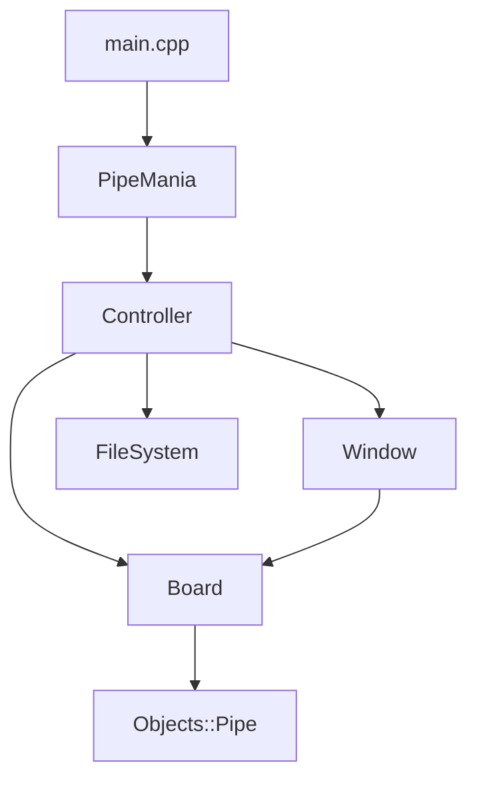
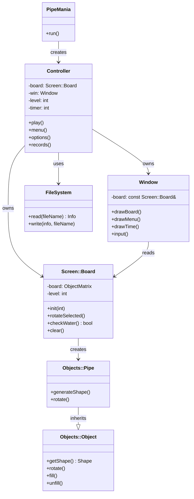

# About Pipe Mania

Pipe Mania is a puzzle video game developed by The Assembly Line for the Amiga and published in 1989.It was ported to several other platforms by Lucasfilm Games as Pipe Dream;
the company distributed the game in the US. The player must connect randomly appearing pieces of pipe on a grid to a given length within a limited time.
The Windows version of the game was included in the MS Windows Entertainment Pack. In 1990, it was released as an arcade game by Japanese manufacturer Video System Co. Ltd.,
though with slightly altered gameplay, giving the player the task to connect a source and drain with the random pipe pieces.
Long after its initial release, the Pipe Mania concept re-emerged as a minigame representing hacking or security system bypassing in larger video games.

## Gameplay

The game is played on a grid of squares, one of which is marked as an entry point for a flow of green slime, referred to in-game as "flooz" or "goo" depending on the version. 
A column of five pipe sections is displayed to one side as a dispenser. When the player clicks on an empty square,the bottommost piece is the dispenser is placed there and
a new piece drops in from the top.
Pieces cannot be rotated or flipped, but must be used in their original orientation.
The objective is to form an unbroken pipeline through which the flooz can flow, starting from the entry point and extending for at least a specified minimum number of squares.

The flooz begins to flow after a set time delay, and continues to do so until it reaches a pipe-end that is either open or blocked by a square/playfield edge.
If the pipeline has reached or exceeded the minimum required length, the player advances to the next level; if not, the game ends.

## How To Play

[ `↑` ] - Up 

[ `↓` ] - Down

[ `←` ] - Move Left

[ `→` ] - Move Right

[ `Enter`] - Rotate

[ `ESC` ] - Go Back

## What you need

You must use linux system

Install Ncurses and make

```
sudo apt-get install libncurses5-dev
sudo apt-get install make
```
## Build and Run

### In project:

Run - `./pipe`
Remove output file - `make clean`
In order to run all the commands mentioned above - `make`

## Architecture



## Class Dependency



## Demo Screenshots

### Menu


### Options


### Gameplay


### Records


## References

[About game in Wikipedia](https://en.wikipedia.org/wiki/Pipe_Mania)
[About Ncurses in Wikipedia](https://en.wikipedia.org/wiki/Ncurses)